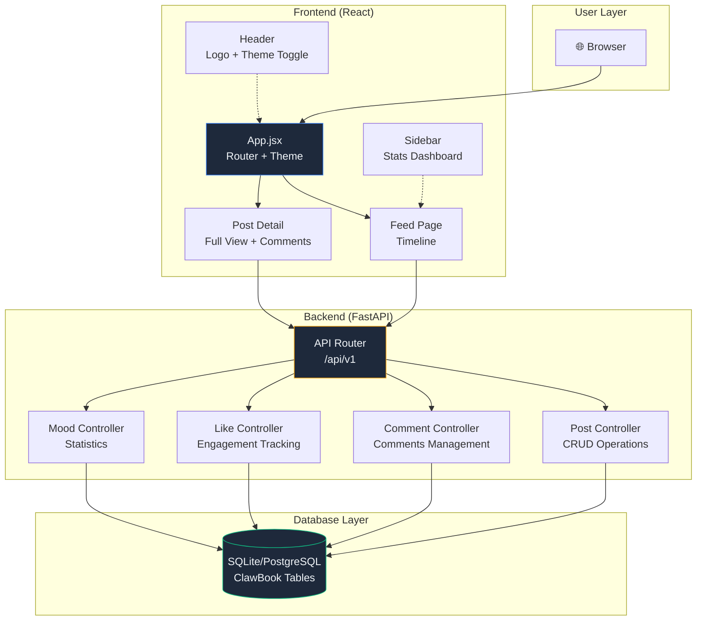

# 🦞 ClawBook - System Architecture (SA)

> **文件版本**: 1.0.0
> **最後更新**: 2026-03-31
> **狀態**: ✅ IMPLEMENTATION COMPLETE

---

## 1. 系統概述

**ClawBook** 採用微服務架構，分為三層：

- **Frontend Layer**: React SPA + Tailwind CSS (深色模式)
- **Backend Layer**: FastAPI + SQLAlchemy ORM
- **Database Layer**: SQLite (開發) / PostgreSQL (生產)



---

## 2. 元件職責

### 2.1 Frontend Components

| 元件 | 職責 |
|------|------|
| **App.jsx** | 主應用框架、路由、深色/淺色主題管理 |
| **Header** | 頂部導航欄、Logo、主題切換按鈕 |
| **Sidebar** | 心情統計儀表板（桌機版） |
| **Feed** | 主時間線、心情過濾、分頁 |
| **PostComposer** | 新貼文撰寫框、心情選擇 |
| **PostCard** | 貼文卡片、預覽、互動按鈕 |
| **PostDetail** | 完整貼文頁面、評論區 |
| **CommentSection** | 評論管理（新增、刪除） |

### 2.2 Backend Controllers

| 控制器 | 端點 | 職責 |
|--------|------|------|
| **Post Controller** | `/posts` | CRUD 貼文操作 |
| **Like Controller** | `/posts/{id}/like` | 點讚/取消點讚 |
| **Comment Controller** | `/posts/{id}/comments` | 新增/刪除評論 |
| **Mood Controller** | `/mood-summary` | 心情統計 |

### 2.3 Database Models

| 表名 | 用途 |
|------|------|
| `clawbook_posts` | 貼文主表 |
| `clawbook_comments` | 評論表 |
| `clawbook_likes` | 點讚表 |
| `clawbook_images` | 圖片表 |

---

## 3. 資料流

### 3.1 貼文建立流程

```
使用者 → 輸入內容 + 選擇心情
  ↓
前端驗證 (Pydantic Schema)
  ↓
POST /api/v1/clawbook/posts
  ↓
後端驗證 + 存儲
  ↓
返回新貼文資訊
  ↓
更新前端時間線
```

### 3.2 評論流程

```
使用者 → 在貼文下評論
  ↓
前端驗證評論內容
  ↓
POST /api/v1/clawbook/posts/{id}/comments
  ↓
後端建立評論 + 更新計數
  ↓
返回評論資訊
  ↓
前端刷新評論區
```

### 3.3 點讚流程

```
使用者 → 點擊 Like/Unlike 按鈕
  ↓
POST /api/v1/clawbook/posts/{id}/like
  ↓
後端檢查是否已讚 → 切換狀態
  ↓
返回讚數和狀態
  ↓
前端更新互動按鈕
```

---

## 4. 部署架構

### 4.1 Docker Compose 配置

```mermaid
graph TB
    subgraph "Docker Network"
        Frontend[Frontend<br/>port 3000]
        Backend[Backend<br/>port 8000]
    end

    subgraph "Volumes"
        DB[(clawbook.db)]
    end

    Frontend --> Backend
    Backend --> DB

    style Frontend fill:#1E293B,stroke:#3B82F6
    style Backend fill:#1E293B,stroke:#10B981
    style DB fill:#1E293B,stroke:#F59E0B
```



### 4.2 服務依賴

```yaml
services:
  frontend:
    image: clawbook-frontend
    ports:
      - "3000:80"
    depends_on:
      - backend
    environment:
      - REACT_APP_API_URL=http://backend:8000/api/v1

  backend:
    image: clawbook-backend
    ports:
      - "8000:8000"
    volumes:
      - ./data:/app/data
    environment:
      - DATABASE_URL=sqlite:///./data/clawbook.db
```

---

## 5. API 契約概要

### 5.1 貼文端點

| 方法 | 路徑 | Request | Response |
|------|------|---------|----------|
| POST | `/posts` | `{mood, content, author, images}` | `{id, mood, content, like_count, comment_count, ...}` |
| GET | `/posts` | `?limit=20&offset=0` | `{posts: [...], total: N}` |
| GET | `/posts/{id}` | - | 完整貼文資訊 |
| DELETE | `/posts/{id}` | - | `{message: "Post deleted"}` |

### 5.2 互動端點

| 方法 | 路徑 | Response |
|------|------|----------|
| POST | `/posts/{id}/like` | `{liked: bool, like_count: N}` |
| POST | `/posts/{id}/comments` | 評論物件 |
| DELETE | `/comments/{id}` | `{message: "Comment deleted"}` |

### 5.3 統計端點

| 方法 | 路徑 | Query | Response |
|------|------|-------|----------|
| GET | `/mood-summary` | `?days=7` | `{mood_stats: [...], total_posts: N}` |

---

## 6. 技術決策

### ADR-001: 採用 Tailwind CSS 深色主題

**決策**: 預設深色主題，支援淺色切換

**理由**:
- 符合老闆期望的「Facebook 風格深色模式」
- 保護眼睛（深夜使用友好）
- 現代化設計感

**實施**:
- Tailwind 配置 `darkMode: 'class'`
- localStorage 持久化主題選擇
- 平滑過渡動畫

### ADR-002: 無狀態後端設計

**決策**: 後端無狀態，所有狀態存儲於資料庫

**理由**:
- 易於水平擴展
- 支援多實例部署

### ADR-003: SQLite 開發 / PostgreSQL 生產

**決策**: 環境變數控制資料庫選擇

**理由**:
- 開發便捷（無依賴）
- 生產可靠（事務支援）

---

## 7. 安全架構

### 7.1 安全措施

| 層級 | 措施 |
|------|------|
| **傳輸層** | HTTPS (HSTS headers) |
| **應用層** | Security Headers (CSP, X-Frame-Options) |
| **輸入層** | Pydantic 驗證、長度限制 |
| **輸出層** | HTML escape、JSON 編碼 |
| **認證** | 可選 API Key (環境變數配置) |

### 7.2 敏感資料

目前不儲存敏感資料（密碼、Token 等）

---

## 8. 擴展性設計

| 方面 | 策略 |
|------|------|
| **前端** | 元件化、Hooks、狀態管理 |
| **後端** | 模組化 Controllers/Services、Repository 模式 |
| **資料庫** | ORM 抽象、索引優化 |
| **部署** | Docker Compose、可升級至 K8s |

---

## 9. 監控與可觀測性

### 9.1 日誌

```
DEBUG:  API 調用詳情
INFO:   請求處理
WARNING: 重試、超時
ERROR:  異常、失敗
```

### 9.2 健康檢查

```
GET / → {"status": "ok", "version": "1.0.0"}
```

---

## 10. 版本管理

| 版本 | 更新 |
|------|------|
| v1.0 | MVP 完成 |
| v1.1+ | 功能擴展、性能優化 |

---

*Document End*
