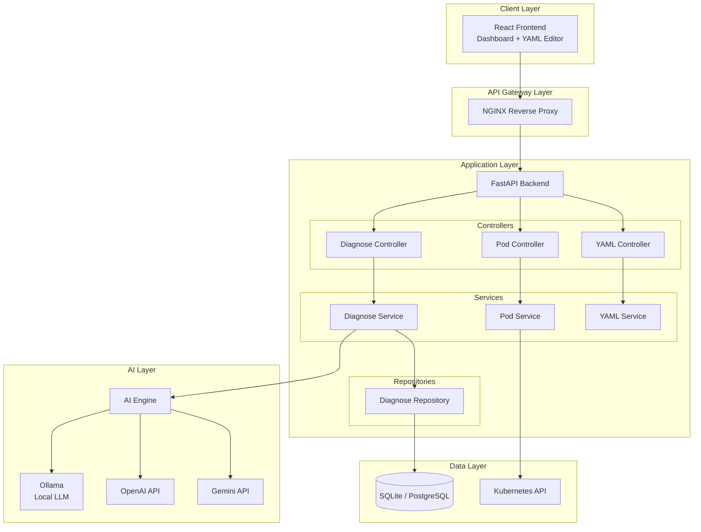
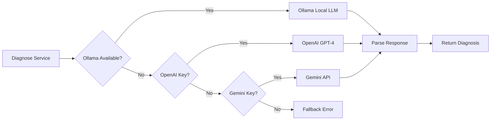
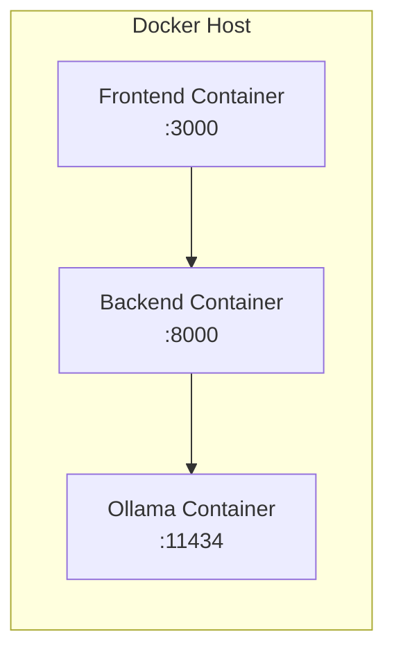
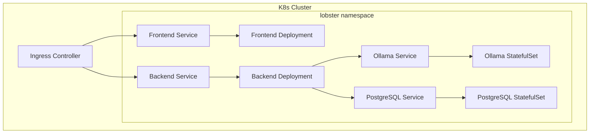

# 🦞 Lobster K8s Copilot - 系統架構文件 (SA)

## 1. 文件資訊
| 項目 | 內容 |
|------|------|
| 文件版本 | 1.0.0 |
| 建立日期 | 2026-03-07 |
| 撰寫者 | System Architect (Lobster Team) |
| 狀態 | Approved |

---

## 2. 系統架構總覽

### 2.1 架構風格
本系統採用 **Layered Architecture（分層架構）** 設計，結合 **Controller-Service-Repository** 模式，確保關注點分離與可測試性。

### 2.2 系統組件圖



---

## 3. 組件詳細設計

### 3.1 Frontend (React)
| 組件 | 職責 |
|------|------|
| `Dashboard` | 主頁面，整合 Pod 列表與診斷面板 |
| `PodList` | 顯示叢集 Pod 狀態表格 |
| `DiagnosePanel` | 觸發診斷並顯示 AI 分析結果 |
| `YAMLCodeEditor` | Monaco Editor 整合，支援語法高亮 |
| `useK8sData` | Custom Hook，管理 K8s 資料抓取 |

### 3.2 Backend (FastAPI)

#### 3.2.1 Controller Layer
負責 HTTP 請求處理與回應序列化。

| 檔案 | 端點 |
|------|------|
| `pod_controller.py` | `/api/v1/cluster/pods` |
| `diagnose_controller.py` | `/api/v1/diagnose/*` |
| `yaml_controller.py` | `/api/v1/yaml/*` |

#### 3.2.2 Service Layer
封裝核心業務邏輯。

| 服務 | 職責 |
|------|------|
| `PodService` | 與 K8s API 互動，取得 Pod 資訊 |
| `DiagnoseService` | 協調 AI Engine 進行診斷 |
| `YAMLService` | YAML 解析、規則檢查、差異比較 |

#### 3.2.3 Repository Layer
資料持久化存取。

| Repository | 職責 |
|------------|------|
| `DiagnoseRepository` | CRUD 診斷歷史記錄 |

### 3.3 AI Engine



#### 3.3.1 多模型路由策略
1. **Local First (Ollama)**：優先使用本地模型，保護資料隱私
2. **Cloud Fallback**：本地不可用時，依序嘗試 OpenAI → Gemini
3. **Confidence Routing**：未來可基於信心值決定是否升級至更強模型

### 3.4 Data Layer

#### 3.4.1 資料庫選擇
- **開發/單機**：SQLite（零配置）
- **生產**：PostgreSQL（可水平擴展）

#### 3.4.2 ORM
使用 SQLAlchemy 2.0+ 作為 ORM，支援 async session。

---

## 4. 部署架構

### 4.1 Docker Compose 部署（單機）



### 4.2 Kubernetes 部署（生產）



---

## 5. 安全架構

### 5.1 網路安全
- **HTTPS Only**：生產環境強制 TLS 1.3
- **CORS 白名單**：限制可信來源
- **Rate Limiting**：防止 API 濫用（slowapi）

### 5.2 認證授權
- **可選 API Key**：透過 `LOBSTER_API_KEY` 環境變數啟用
- **Bearer Token**：支援 `Authorization: Bearer <key>` 或 `X-API-Key` header

### 5.3 資料安全
- **敏感資料脫敏**：傳送至 AI 前過濾密鑰、Token
- **Secret 攔截**：禁止擷取 `Kind: Secret` 內容
- **日誌過濾**：不記錄敏感請求內容

### 5.4 Security Headers
```python
X-Content-Type-Options: nosniff
X-Frame-Options: DENY
X-XSS-Protection: 1; mode=block
Referrer-Policy: strict-origin-when-cross-origin
Permissions-Policy: geolocation=(), microphone=(), camera=()
Strict-Transport-Security: max-age=31536000; includeSubDomains
```

---

## 6. 可觀測性

### 6.1 日誌
- **格式**：JSON structured logging
- **等級**：DEBUG / INFO / WARNING / ERROR
- **輸出**：stdout（容器環境）

### 6.2 指標（未來）
- Prometheus metrics endpoint `/metrics`
- Key metrics: request_count, request_latency, ai_inference_time

### 6.3 追蹤（未來）
- OpenTelemetry integration
- Distributed tracing for AI calls

---

## 7. 技術選型依據

| 技術 | 選擇 | 理由 |
|------|------|------|
| Backend Framework | FastAPI | 高效能、原生 async、自動 OpenAPI |
| Frontend Framework | React | 生態成熟、組件化、團隊熟悉 |
| CSS Framework | Tailwind CSS | 快速開發、無重複樣式 |
| ORM | SQLAlchemy 2.0 | 業界標準、支援 async |
| AI Local | Ollama | 開源、支援多模型、隱私保護 |
| Container | Docker | 業界標準、跨平台一致性 |
| Orchestration | Kubernetes | 雲原生標準、自動擴展 |

---

## 8. 限制與假設

### 8.1 假設
- 用戶具備 K8s 基本知識
- 叢集已啟用 metrics-server（可選）
- 網路可存取 K8s API server

### 8.2 限制
- 單一 K8s context（不支援多叢集切換）
- AI 診斷依賴外部模型服務可用性
- YAML 檔案大小限制 512KB

---

*文件結束*
