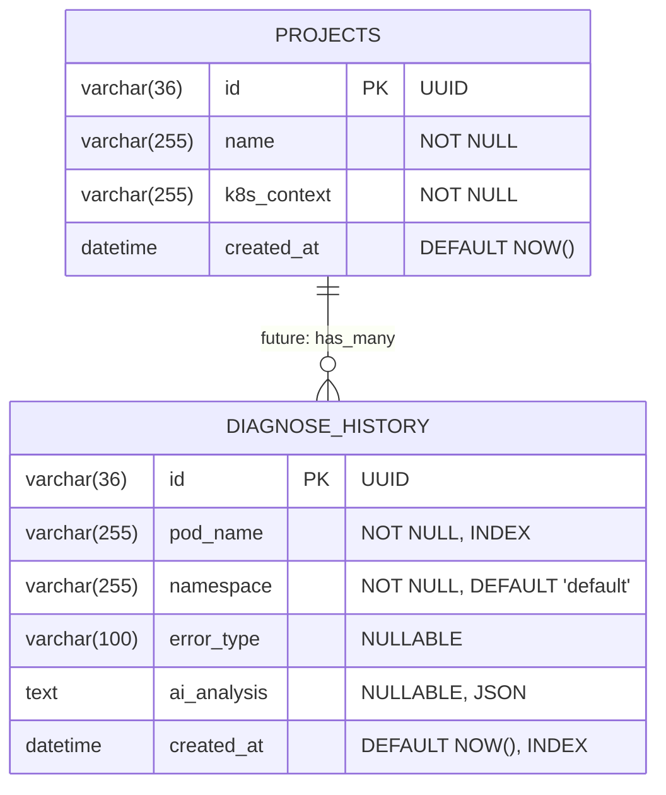
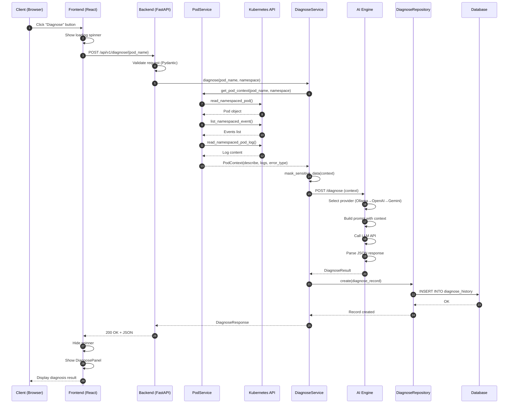
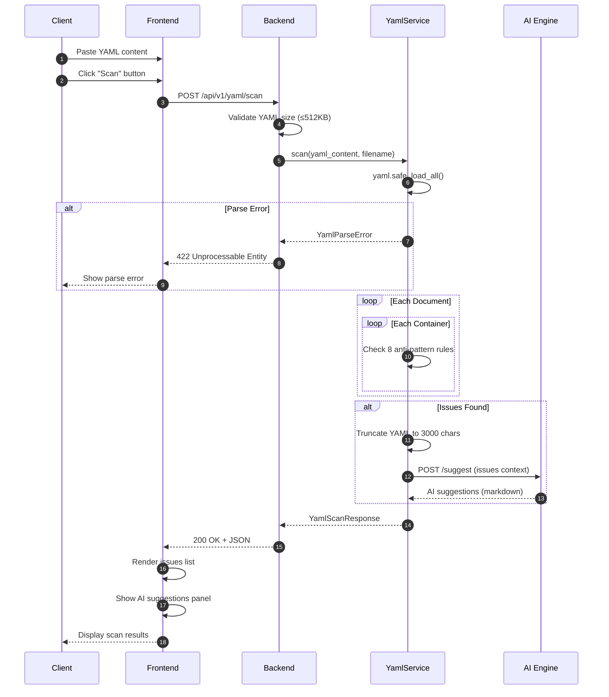
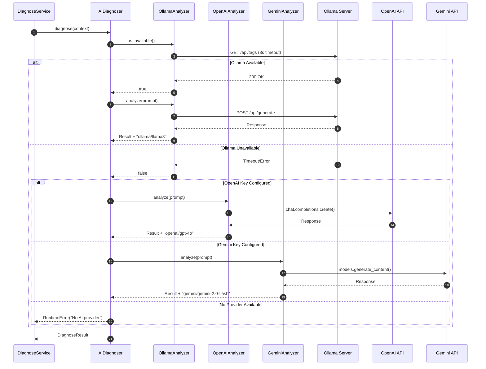

# 🦞 Lobster K8s Copilot - 系統設計文件 (SD)

> **文件版本**: 1.0.0  
> **最後更新**: 2026-03-07  
> **狀態**: ✅ APPROVED

---

## 1. API 定義 (RESTful)

### 1.1 API 基礎資訊

| 屬性 | 值 |
|------|-----|
| **Base URL** | `/api/v1` |
| **Content-Type** | `application/json` |
| **認證方式** | Bearer Token 或 X-API-Key (可選) |
| **版本策略** | URL Path Versioning |

### 1.2 通用回應格式

**成功回應**:
```json
{
  "data": { ... },
  "message": "Success"
}
```

**錯誤回應**:
```json
{
  "detail": "Error message description"
}
```

### 1.3 HTTP 狀態碼

| 狀態碼 | 說明 |
|--------|------|
| 200 | 成功 |
| 400 | 請求參數錯誤 |
| 401 | 未授權 (API Key 無效) |
| 404 | 資源未找到 |
| 422 | 驗證錯誤 |
| 429 | 請求過於頻繁 |
| 500 | 伺服器內部錯誤 |

---

## 2. API 端點詳細定義

### 2.1 叢集操作 (Cluster)

#### GET /api/v1/cluster/status

取得 Kubernetes 叢集連線狀態與版本資訊。

**Request**:
```http
GET /api/v1/cluster/status
```

**Response** (200 OK):
```json
{
  "connected": true,
  "version": "v1.28.3",
  "platform": "linux/amd64"
}
```

**Response** (503 Service Unavailable):
```json
{
  "connected": false,
  "error": "Unable to connect to Kubernetes API"
}
```

---

#### GET /api/v1/cluster/pods

列出叢集中所有 Pod，支援 Namespace 篩選。

**Request**:
```http
GET /api/v1/cluster/pods?namespace=default
```

**Query Parameters**:

| 參數 | 類型 | 必要 | 說明 |
|------|------|------|------|
| `namespace` | string | 否 | 篩選特定 Namespace，空值表示所有 |

**Response** (200 OK):
```json
{
  "pods": [
    {
      "name": "nginx-7d4c7c5b5f-x9m5k",
      "namespace": "default",
      "status": "Running",
      "ip": "10.244.0.5",
      "node": "worker-01",
      "containers": [
        {
          "name": "nginx",
          "image": "nginx:1.25",
          "ready": true,
          "restarts": 0
        }
      ],
      "conditions": [
        {
          "type": "Ready",
          "status": "True",
          "reason": null,
          "message": null
        }
      ],
      "created_at": "2026-03-07T10:00:00Z"
    }
  ],
  "total": 42
}
```

**Response Schema**:

```typescript
interface PodListResponse {
  pods: Pod[];
  total: number;
}

interface Pod {
  name: string;
  namespace: string;
  status: "Running" | "Pending" | "Succeeded" | "Failed" | "Unknown";
  ip: string | null;
  node: string | null;
  containers: Container[];
  conditions: Condition[];
  created_at: string;  // ISO 8601
}

interface Container {
  name: string;
  image: string;
  ready: boolean;
  restarts: number;
}

interface Condition {
  type: string;
  status: "True" | "False" | "Unknown";
  reason: string | null;
  message: string | null;
}
```

---

### 2.2 AI 診斷 (Diagnose)

#### POST /api/v1/diagnose/{pod_name}

對指定 Pod 執行 AI 故障診斷。

**Request**:
```http
POST /api/v1/diagnose/my-app-crash
Content-Type: application/json

{
  "namespace": "default",
  "force": false
}
```

**Path Parameters**:

| 參數 | 類型 | 必要 | 說明 |
|------|------|------|------|
| `pod_name` | string | 是 | Pod 名稱，需符合 K8s DNS-subdomain 規範 |

**Request Body**:

| 欄位 | 類型 | 必要 | 預設值 | 說明 |
|------|------|------|--------|------|
| `namespace` | string | 否 | `"default"` | Pod 所在 Namespace |
| `force` | boolean | 否 | `false` | 強制重新分析 (忽略快取) |

**Request Schema**:
```typescript
interface DiagnoseRequest {
  namespace?: string;  // default: "default"
  force?: boolean;     // default: false
}
```

**Response** (200 OK):
```json
{
  "pod_name": "my-app-crash",
  "namespace": "default",
  "error_type": "CrashLoopBackOff",
  "root_cause": "Database connection timeout after 3 retries. The application fails to connect to PostgreSQL at 10.0.1.5:5432.",
  "detailed_analysis": "The pod is repeatedly crashing due to a database connectivity issue. Analysis of the logs shows:\n\n1. Connection attempt to PostgreSQL at startup\n2. 3 retry attempts with exponential backoff\n3. Application exits with code 1 after timeout\n\nPossible causes:\n- Database service is down\n- Network policy blocking traffic\n- Incorrect database credentials",
  "remediation": "1. Verify database service status:\n   ```bash\n   kubectl get svc -n database\n   kubectl get pods -n database\n   ```\n\n2. Check network connectivity:\n   ```bash\n   kubectl exec my-app-crash -- nc -zv 10.0.1.5 5432\n   ```\n\n3. Verify credentials in secret:\n   ```bash\n   kubectl get secret db-credentials -o yaml\n   ```",
  "raw_analysis": "{\"root_cause\": \"...\", \"detailed_analysis\": \"...\", \"remediation\": \"...\"}",
  "model_used": "openai/gpt-4o",
  "diagnosed_at": "2026-03-07T11:00:00Z"
}
```

**Response Schema**:
```typescript
interface DiagnoseResponse {
  pod_name: string;
  namespace: string;
  error_type: string | null;  // CrashLoopBackOff, OOM, ImagePullBackOff, etc.
  root_cause: string;
  detailed_analysis: string | null;
  remediation: string;
  raw_analysis: string;  // Raw JSON from LLM
  model_used: string;    // e.g., "ollama/llama3", "openai/gpt-4o"
  diagnosed_at: string;  // ISO 8601
}
```

**Error Responses**:

| 狀態碼 | 情況 | 回應 |
|--------|------|------|
| 404 | Pod 不存在 | `{"detail": "Pod 'xxx' not found in namespace 'default'"}` |
| 503 | K8s API 不可用 | `{"detail": "Unable to connect to Kubernetes API"}` |
| 503 | AI 服務不可用 | `{"detail": "AI diagnosis service unavailable"}` |

---

#### GET /api/v1/diagnose/history

取得診斷歷史記錄。

**Request**:
```http
GET /api/v1/diagnose/history?limit=50&search=crash
```

**Query Parameters**:

| 參數 | 類型 | 必要 | 預設值 | 說明 |
|------|------|------|--------|------|
| `limit` | integer | 否 | 50 | 返回筆數上限 (1-100) |
| `search` | string | 否 | - | 全文搜尋關鍵字 |
| `namespace` | string | 否 | - | 篩選特定 Namespace |
| `error_type` | string | 否 | - | 篩選錯誤類型 |

**Response** (200 OK):
```json
{
  "history": [
    {
      "id": "550e8400-e29b-41d4-a716-446655440000",
      "pod_name": "my-app-crash",
      "namespace": "default",
      "error_type": "CrashLoopBackOff",
      "root_cause": "Database connection timeout...",
      "model_used": "openai/gpt-4o",
      "created_at": "2026-03-07T11:00:00Z"
    }
  ],
  "total": 1
}
```

**Response Schema**:
```typescript
interface HistoryListResponse {
  history: DiagnoseHistoryRecord[];
  total: number;
}

interface DiagnoseHistoryRecord {
  id: string;  // UUID
  pod_name: string;
  namespace: string;
  error_type: string | null;
  root_cause: string;
  model_used: string;
  created_at: string;  // ISO 8601
}
```

---

#### GET /api/v1/diagnose/history/{pod_name}

取得特定 Pod 的診斷歷史。

**Request**:
```http
GET /api/v1/diagnose/history/my-app
```

**Response** (200 OK):
```json
{
  "history": [...],
  "total": 5
}
```

---

### 2.3 YAML 管理

#### POST /api/v1/yaml/scan

掃描 YAML 配置檔，偵測 anti-pattern。

**Request**:
```http
POST /api/v1/yaml/scan
Content-Type: application/json

{
  "yaml_content": "apiVersion: apps/v1\nkind: Deployment\nmetadata:\n  name: nginx\nspec:\n  replicas: 1\n  selector:\n    matchLabels:\n      app: nginx\n  template:\n    metadata:\n      labels:\n        app: nginx\n    spec:\n      containers:\n      - name: nginx\n        image: nginx:latest",
  "filename": "deployment.yaml"
}
```

**Request Body**:

| 欄位 | 類型 | 必要 | 限制 | 說明 |
|------|------|------|------|------|
| `yaml_content` | string | 是 | ≤512KB | YAML 內容 (支援多文件 `---` 分隔) |
| `filename` | string | 否 | - | 檔案名稱 (用於顯示) |

**Request Schema**:
```typescript
interface YamlScanRequest {
  yaml_content: string;  // max 512KB
  filename?: string;     // default: "manifest.yaml"
}
```

**Response** (200 OK):
```json
{
  "filename": "deployment.yaml",
  "issues": [
    {
      "severity": "ERROR",
      "rule": "no-resource-limits",
      "message": "Container 'nginx' is missing CPU/Memory resource limits. Set resources.limits to prevent OOM and resource contention.",
      "line": null,
      "container": "nginx"
    },
    {
      "severity": "WARNING",
      "rule": "latest-image-tag",
      "message": "Container 'nginx' uses 'latest' image tag. Pin to a specific version for reproducible deployments.",
      "line": null,
      "container": "nginx"
    },
    {
      "severity": "WARNING",
      "rule": "no-liveness-probe",
      "message": "Container 'nginx' is missing livenessProbe. Add probe for automatic pod recovery.",
      "line": null,
      "container": "nginx"
    },
    {
      "severity": "WARNING",
      "rule": "no-readiness-probe",
      "message": "Container 'nginx' is missing readinessProbe. Add probe for proper traffic routing.",
      "line": null,
      "container": "nginx"
    }
  ],
  "total_issues": 4,
  "has_errors": true,
  "ai_suggestions": "Here's how to fix the identified issues:\n\n## 1. Add Resource Limits\n```yaml\nresources:\n  requests:\n    cpu: 100m\n    memory: 128Mi\n  limits:\n    cpu: 500m\n    memory: 512Mi\n```\n\n## 2. Pin Image Version\n```yaml\nimage: nginx:1.25.3\n```\n\n## 3. Add Probes\n```yaml\nlivenessProbe:\n  httpGet:\n    path: /\n    port: 80\n  initialDelaySeconds: 15\n  periodSeconds: 10\nreadinessProbe:\n  httpGet:\n    path: /\n    port: 80\n  initialDelaySeconds: 5\n  periodSeconds: 5\n```"
}
```

**Response Schema**:
```typescript
interface YamlScanResponse {
  filename: string;
  issues: YamlIssue[];
  total_issues: number;
  has_errors: boolean;  // true if any ERROR severity
  ai_suggestions: string | null;  // Markdown format
}

interface YamlIssue {
  severity: "ERROR" | "WARNING" | "INFO";
  rule: string;
  message: string;
  line: number | null;
  container?: string;
}
```

**YAML 掃描規則**:

| Rule ID | 嚴重度 | 檢查項目 |
|---------|--------|----------|
| `no-resource-limits` | ERROR | Container 缺少 `resources.limits` |
| `no-resource-requests` | WARNING | Container 缺少 `resources.requests` |
| `privileged-container` | ERROR | `securityContext.privileged: true` |
| `run-as-root` | ERROR | 缺少 `runAsNonRoot: true` |
| `no-liveness-probe` | WARNING | 缺少 `livenessProbe` |
| `no-readiness-probe` | WARNING | 缺少 `readinessProbe` |
| `latest-image-tag` | WARNING | 使用 `:latest` 或無 tag |
| `ingress-nginx-deprecation` | ERROR | 使用已棄用的 ingress-nginx |

---

#### POST /api/v1/yaml/diff

比對兩份 YAML 配置的差異。

**Request**:
```http
POST /api/v1/yaml/diff
Content-Type: application/json

{
  "yaml_a": "apiVersion: v1\nkind: Service\nmetadata:\n  name: app\nspec:\n  ports:\n  - port: 80",
  "yaml_b": "apiVersion: v1\nkind: Service\nmetadata:\n  name: app\nspec:\n  ports:\n  - port: 8080\n  type: LoadBalancer"
}
```

**Request Body**:

| 欄位 | 類型 | 必要 | 說明 |
|------|------|------|------|
| `yaml_a` | string | 是 | 第一份 YAML (通常為 baseline) |
| `yaml_b` | string | 是 | 第二份 YAML (通常為比較對象) |
| `label_a` | string | 否 | 第一份標籤 (預設 "Source A") |
| `label_b` | string | 否 | 第二份標籤 (預設 "Source B") |

**Request Schema**:
```typescript
interface YamlDiffRequest {
  yaml_a: string;
  yaml_b: string;
  label_a?: string;
  label_b?: string;
}
```

**Response** (200 OK):
```json
{
  "differences": {
    "values_changed": {
      "root['spec']['ports'][0]['port']": {
        "old_value": 80,
        "new_value": 8080
      }
    },
    "dictionary_item_added": {
      "root['spec']['type']": "LoadBalancer"
    },
    "dictionary_item_removed": {},
    "iterable_item_added": {},
    "iterable_item_removed": {}
  },
  "summary": {
    "total_changes": 2,
    "values_changed": 1,
    "items_added": 1,
    "items_removed": 0
  },
  "risk_assessment": [
    {
      "path": "spec.ports[0].port",
      "risk": "HIGH",
      "message": "Port change from 80 to 8080 may break existing clients"
    },
    {
      "path": "spec.type",
      "risk": "MEDIUM",
      "message": "Adding LoadBalancer type will provision external IP (cost implications)"
    }
  ]
}
```

**Response Schema**:
```typescript
interface YamlDiffResponse {
  differences: DeepDiffResult;
  summary: DiffSummary;
  risk_assessment: RiskItem[];
}

interface DeepDiffResult {
  values_changed: Record<string, { old_value: any; new_value: any }>;
  dictionary_item_added: Record<string, any>;
  dictionary_item_removed: Record<string, any>;
  iterable_item_added: Record<string, any>;
  iterable_item_removed: Record<string, any>;
}

interface DiffSummary {
  total_changes: number;
  values_changed: number;
  items_added: number;
  items_removed: number;
}

interface RiskItem {
  path: string;
  risk: "HIGH" | "MEDIUM" | "LOW";
  message: string;
}
```

---

## 3. AI Engine API

AI Engine 作為獨立微服務，提供 LLM 推論能力。

### 3.1 Health Check

#### GET /health

**Response** (200 OK):
```json
{
  "status": "healthy",
  "providers": {
    "ollama": true,
    "openai": false,
    "gemini": true
  }
}
```

---

### 3.2 Diagnose

#### POST /diagnose

**Request**:
```json
{
  "pod_name": "my-app",
  "namespace": "default",
  "describe": "Name: my-app\nStatus: Running\n...",
  "logs": "ERROR: Connection refused...",
  "error_type": "CrashLoopBackOff"
}
```

**Response** (200 OK):
```json
{
  "root_cause": "Database connection failure",
  "detailed_analysis": "...",
  "remediation": "...",
  "raw_analysis": "{...}",
  "model_used": "ollama/llama3"
}
```

---

### 3.3 Suggest

#### POST /suggest

通用提示詞呼叫，用於 YAML AI 建議。

**Request**:
```json
{
  "prompt": "Given these YAML issues, provide remediation steps:\n\n1. Missing resource limits\n2. Using latest tag",
  "context": "..."
}
```

**Response** (200 OK):
```json
{
  "suggestion": "## Remediation Steps\n\n1. Add resource limits...",
  "model_used": "openai/gpt-4o"
}
```

---

## 4. Database Schema

### 4.1 ER Diagram



### 4.2 Table: projects

> 預留給未來多叢集支援

| 欄位 | 類型 | 約束 | 說明 |
|------|------|------|------|
| `id` | VARCHAR(36) | PK | UUID |
| `name` | VARCHAR(255) | NOT NULL | 專案名稱 |
| `k8s_context` | VARCHAR(255) | NOT NULL | K8s context 名稱 |
| `created_at` | DATETIME | DEFAULT NOW | 建立時間 |

**DDL**:
```sql
CREATE TABLE projects (
    id VARCHAR(36) PRIMARY KEY,
    name VARCHAR(255) NOT NULL,
    k8s_context VARCHAR(255) NOT NULL,
    created_at DATETIME DEFAULT CURRENT_TIMESTAMP
);
```

---

### 4.3 Table: diagnose_history

| 欄位 | 類型 | 約束 | 說明 |
|------|------|------|------|
| `id` | VARCHAR(36) | PK | UUID |
| `pod_name` | VARCHAR(255) | NOT NULL, INDEX | Pod 名稱 |
| `namespace` | VARCHAR(255) | NOT NULL, DEFAULT 'default' | Namespace |
| `error_type` | VARCHAR(100) | NULLABLE | 錯誤類型 |
| `ai_analysis` | TEXT | NULLABLE | AI 分析結果 (JSON) |
| `created_at` | DATETIME | DEFAULT NOW, INDEX | 建立時間 |

**Indexes**:
- `ix_diagnose_history_pod_name` (pod_name)
- `ix_diagnose_history_created_at` (created_at)
- `ix_diagnose_history_pod_namespace` (pod_name, namespace)

**DDL**:
```sql
CREATE TABLE diagnose_history (
    id VARCHAR(36) PRIMARY KEY,
    pod_name VARCHAR(255) NOT NULL,
    namespace VARCHAR(255) NOT NULL DEFAULT 'default',
    error_type VARCHAR(100),
    ai_analysis TEXT,
    created_at DATETIME DEFAULT CURRENT_TIMESTAMP
);

CREATE INDEX ix_diagnose_history_pod_name ON diagnose_history(pod_name);
CREATE INDEX ix_diagnose_history_created_at ON diagnose_history(created_at);
CREATE INDEX ix_diagnose_history_pod_namespace ON diagnose_history(pod_name, namespace);
```

---

### 4.4 ai_analysis JSON Schema

儲存於 `ai_analysis` 欄位的 JSON 結構：

```json
{
  "root_cause": "string - 根因分析",
  "detailed_analysis": "string | null - 詳細分析",
  "remediation": "string - 修復建議",
  "model_used": "string - 使用的 AI 模型"
}
```

---

## 5. 錯誤處理策略

### 5.1 錯誤分類

| 類別 | HTTP Code | 處理方式 |
|------|-----------|----------|
| **客戶端錯誤** | 4xx | 返回明確錯誤訊息 |
| **資源未找到** | 404 | `{"detail": "Resource not found"}` |
| **驗證錯誤** | 422 | Pydantic 自動處理，含欄位資訊 |
| **服務不可用** | 503 | 返回降級狀態說明 |
| **伺服器錯誤** | 500 | 記錄詳細日誌，返回通用訊息 |

### 5.2 自定義例外

```python
class LobsterException(Exception):
    """Base exception for Lobster K8s Copilot."""
    pass

class PodNotFoundError(LobsterException):
    """Raised when pod is not found in cluster."""
    def __init__(self, pod_name: str, namespace: str):
        self.pod_name = pod_name
        self.namespace = namespace
        super().__init__(f"Pod '{pod_name}' not found in namespace '{namespace}'")

class K8sConnectionError(LobsterException):
    """Raised when unable to connect to Kubernetes API."""
    pass

class AIServiceUnavailableError(LobsterException):
    """Raised when no AI provider is available."""
    pass

class YamlParseError(LobsterException):
    """Raised when YAML content cannot be parsed."""
    pass
```

### 5.3 Exception Handler

```python
@app.exception_handler(PodNotFoundError)
async def pod_not_found_handler(request: Request, exc: PodNotFoundError):
    return JSONResponse(
        status_code=404,
        content={"detail": str(exc)}
    )

@app.exception_handler(K8sConnectionError)
async def k8s_connection_handler(request: Request, exc: K8sConnectionError):
    return JSONResponse(
        status_code=503,
        content={"detail": "Unable to connect to Kubernetes API"}
    )
```

---

## 6. 序列圖

### 6.1 Pod 診斷完整流程



### 6.2 YAML 掃描流程



### 6.3 AI Provider Fallback 流程



---

## 7. 模組介面定義

### 7.1 Service Layer Interfaces

```python
# backend/services/pod_service.py

class PodService:
    """Kubernetes Pod operations service."""
    
    def list_pods(self, namespace: str | None = None) -> PodListResponse:
        """
        List pods in cluster.
        
        Args:
            namespace: Filter by namespace, None for all namespaces.
            
        Returns:
            PodListResponse with pods list and total count.
            
        Raises:
            K8sConnectionError: If unable to connect to K8s API.
        """
        ...
    
    def get_pod_context(self, pod_name: str, namespace: str) -> PodContext:
        """
        Collect pod context for diagnosis.
        
        Args:
            pod_name: Name of the pod.
            namespace: Pod namespace.
            
        Returns:
            PodContext with describe output, logs, and error_type.
            
        Raises:
            PodNotFoundError: If pod does not exist.
            K8sConnectionError: If unable to connect to K8s API.
        """
        ...
```

```python
# backend/services/diagnose_service.py

class DiagnoseService:
    """AI-powered pod diagnosis service."""
    
    def diagnose(
        self, 
        pod_name: str, 
        namespace: str, 
        db: Session,
        force: bool = False
    ) -> DiagnoseResponse:
        """
        Perform AI diagnosis on a pod.
        
        Args:
            pod_name: Name of the pod to diagnose.
            namespace: Pod namespace.
            db: Database session for persistence.
            force: Force re-analysis ignoring cache.
            
        Returns:
            DiagnoseResponse with root_cause, remediation, etc.
            
        Raises:
            PodNotFoundError: If pod does not exist.
            AIServiceUnavailableError: If no AI provider available.
        """
        ...
```

```python
# backend/services/yaml_service.py

class YamlService:
    """YAML scanning and diffing service."""
    
    def scan(self, yaml_content: str, filename: str) -> YamlScanResponse:
        """
        Scan YAML for anti-patterns.
        
        Args:
            yaml_content: YAML content to scan.
            filename: Original filename for display.
            
        Returns:
            YamlScanResponse with issues and AI suggestions.
            
        Raises:
            YamlParseError: If YAML cannot be parsed.
        """
        ...
    
    def diff(self, yaml_a: str, yaml_b: str) -> YamlDiffResponse:
        """
        Compare two YAML documents.
        
        Args:
            yaml_a: First YAML document.
            yaml_b: Second YAML document.
            
        Returns:
            YamlDiffResponse with differences and risk assessment.
            
        Raises:
            YamlParseError: If either YAML cannot be parsed.
        """
        ...
```

### 7.2 Repository Layer Interfaces

```python
# backend/repositories/diagnose_repository.py

class DiagnoseRepository:
    """Data access layer for diagnosis history."""
    
    def create(self, db: Session, record: DiagnoseHistoryCreate) -> DiagnoseHistory:
        """Create a new diagnosis history record."""
        ...
    
    def get_history(
        self, 
        db: Session, 
        limit: int = 50,
        search: str | None = None,
        namespace: str | None = None,
        error_type: str | None = None
    ) -> list[DiagnoseHistoryRecord]:
        """Get diagnosis history with filters."""
        ...
    
    def get_by_pod(
        self, 
        db: Session, 
        pod_name: str,
        namespace: str | None = None
    ) -> list[DiagnoseHistoryRecord]:
        """Get all diagnoses for a specific pod."""
        ...
```

### 7.3 AI Engine Interfaces

```python
# ai_engine/analyzers/base.py

from abc import ABC, abstractmethod

class BaseAnalyzer(ABC):
    """Abstract base class for AI analyzers."""
    
    @abstractmethod
    def is_available(self) -> bool:
        """Check if the provider is available."""
        ...
    
    @abstractmethod
    def analyze(self, prompt: str) -> str:
        """
        Analyze the given prompt and return response.
        
        Args:
            prompt: The prompt to analyze.
            
        Returns:
            Raw response string from the LLM.
            
        Raises:
            Exception: If analysis fails.
        """
        ...
    
    @property
    @abstractmethod
    def model_name(self) -> str:
        """Return the model identifier (e.g., 'openai/gpt-4o')."""
        ...
```

```python
# ai_engine/diagnoser.py

class AIDiagnoser:
    """Multi-provider AI diagnosis orchestrator."""
    
    def diagnose(
        self,
        pod_name: str,
        namespace: str,
        describe: str,
        logs: str,
        error_type: str = "Unknown"
    ) -> DiagnoseResult:
        """
        Perform diagnosis using available AI provider.
        
        Args:
            pod_name: Name of the pod.
            namespace: Pod namespace.
            describe: kubectl describe output.
            logs: Pod logs.
            error_type: Detected error type.
            
        Returns:
            DiagnoseResult with root_cause, detailed_analysis, 
            remediation, and model_used.
            
        Raises:
            RuntimeError: If no AI provider is available.
        """
        ...
    
    def suggest(self, prompt: str, context: str = "") -> SuggestResult:
        """
        Get AI suggestions for given prompt.
        
        Args:
            prompt: The question or request.
            context: Additional context.
            
        Returns:
            SuggestResult with suggestion text and model_used.
        """
        ...
```

---

## 8. 前端元件結構

### 8.1 頁面元件

| 元件 | 路由 | 說明 |
|------|------|------|
| `DashboardPage` | `/` | 叢集狀態總覽、Pod 列表 |
| `DiagnosePage` | `/diagnose` | AI 診斷結果頁 |
| `YamlScannerPage` | `/yaml/scan` | YAML 掃描編輯器 |
| `YamlDiffPage` | `/yaml/diff` | YAML 差異比對 |
| `HistoryPage` | `/history` | 診斷歷史查詢 |

### 8.2 共用元件

| 元件 | 說明 |
|------|------|
| `Layout` | 頁面佈局框架 (Sidebar + Header + Main) |
| `Sidebar` | 左側導航選單 |
| `Header` | 頂部標題列 + 主題切換 |
| `PodCard` | Pod 狀態卡片 |
| `DiagnosePanel` | 診斷結果滑入面板 |
| `IssueCard` | YAML 問題卡片 |
| `DiffViewer` | YAML 差異視覺化 |
| `LoadingSpinner` | 載入中動畫 |
| `ErrorBoundary` | 錯誤邊界處理 |

### 8.3 Custom Hooks

```typescript
// hooks/useK8sData.ts
function useK8sData(namespace?: string): {
  pods: Pod[];
  loading: boolean;
  error: Error | null;
  refresh: () => void;
  clusterStatus: ClusterStatus | null;
}

// hooks/useDiagnose.ts
function useDiagnose(): {
  diagnose: (podName: string, namespace: string) => Promise<DiagnoseResponse>;
  loading: boolean;
  result: DiagnoseResponse | null;
  error: Error | null;
}

// hooks/useYamlScan.ts
function useYamlScan(): {
  scan: (content: string, filename?: string) => Promise<YamlScanResponse>;
  loading: boolean;
  result: YamlScanResponse | null;
  error: Error | null;
}

// hooks/useTheme.ts
function useTheme(): {
  theme: "dark" | "light";
  toggleTheme: () => void;
}
```

### 8.4 API Client

```typescript
// services/api.ts
import axios from "axios";

const api = axios.create({
  baseURL: process.env.REACT_APP_API_URL || "/api/v1",
  timeout: 30000,
  headers: {
    "Content-Type": "application/json",
  },
});

// Response interceptor for error handling
api.interceptors.response.use(
  (response) => response,
  (error) => {
    const message = error.response?.data?.detail || "An error occurred";
    // Show toast notification
    return Promise.reject(new Error(message));
  }
);

export const clusterApi = {
  getStatus: () => api.get<ClusterStatus>("/cluster/status"),
  getPods: (namespace?: string) => 
    api.get<PodListResponse>("/cluster/pods", { params: { namespace } }),
};

export const diagnoseApi = {
  diagnose: (podName: string, request: DiagnoseRequest) =>
    api.post<DiagnoseResponse>(`/diagnose/${podName}`, request),
  getHistory: (params?: HistoryParams) =>
    api.get<HistoryListResponse>("/diagnose/history", { params }),
};

export const yamlApi = {
  scan: (request: YamlScanRequest) =>
    api.post<YamlScanResponse>("/yaml/scan", request),
  diff: (request: YamlDiffRequest) =>
    api.post<YamlDiffResponse>("/yaml/diff", request),
};
```

---

## 9. 設計決策記錄

### 9.1 ADR-001: 本地優先 AI 策略

**決策**: 採用 Ollama 本地優先，雲端 fallback 的 AI 策略。

**理由**:
1. **隱私**: Pod 日誌可能包含敏感資料，本地處理避免外洩
2. **成本**: 本地推論無額外費用
3. **延遲**: 區域網路延遲低於雲端 API
4. **可用性**: 無網路時仍可使用

**取捨**:
- 本地需 GPU 或較強 CPU
- 本地模型能力可能不如 GPT-4

---

### 9.2 ADR-002: SQLite 開發 / PostgreSQL 生產

**決策**: 開發環境使用 SQLite，生產環境使用 PostgreSQL。

**理由**:
1. **開發便利**: SQLite 無需額外服務，單檔即可
2. **生產擴展**: PostgreSQL 支援並發、高可用
3. **相容性**: SQLAlchemy ORM 抽象資料庫差異

**實施**:
- 環境變數 `DATABASE_URL` 控制切換
- Alembic 遷移同時支援兩種 dialect

---

### 9.3 ADR-003: 敏感資料遮蔽

**決策**: 傳送至 LLM 前自動遮蔽敏感資料。

**理由**:
1. **安全**: 防止 API Key、密碼洩漏給第三方
2. **合規**: 符合資料保護最佳實踐
3. **透明**: 使用者不需手動清理日誌

**實施**:
- 正則表達式匹配常見敏感模式
- 替換為 `[MASKED]` 佔位符

---

## 10. 附錄

### 10.1 Pydantic Schema 完整定義

```python
# backend/models/schemas.py

from pydantic import BaseModel, Field, field_validator
from typing import Literal
import re

K8S_NAME_PATTERN = re.compile(r'^[a-z0-9]([a-z0-9\-]{0,251}[a-z0-9])?$')

class DiagnoseRequest(BaseModel):
    namespace: str = Field(default="default", max_length=253)
    force: bool = False
    
    @field_validator('namespace')
    @classmethod
    def validate_namespace(cls, v: str) -> str:
        if not K8S_NAME_PATTERN.match(v):
            raise ValueError("Invalid namespace format")
        return v

class YamlScanRequest(BaseModel):
    yaml_content: str = Field(..., max_length=512 * 1024)
    filename: str = Field(default="manifest.yaml", max_length=255)

class YamlDiffRequest(BaseModel):
    yaml_a: str = Field(..., max_length=512 * 1024)
    yaml_b: str = Field(..., max_length=512 * 1024)
    label_a: str = Field(default="Source A", max_length=50)
    label_b: str = Field(default="Source B", max_length=50)

class YamlIssue(BaseModel):
    severity: Literal["ERROR", "WARNING", "INFO"]
    rule: str
    message: str
    line: int | None = None
    container: str | None = None

class YamlScanResponse(BaseModel):
    filename: str
    issues: list[YamlIssue]
    total_issues: int
    has_errors: bool
    ai_suggestions: str | None = None

class DiagnoseResponse(BaseModel):
    pod_name: str
    namespace: str
    error_type: str | None
    root_cause: str
    detailed_analysis: str | None
    remediation: str
    raw_analysis: str
    model_used: str
    diagnosed_at: str | None = None
```

### 10.2 環境變數完整清單

| 變數 | 必要 | 預設值 | 說明 |
|------|------|--------|------|
| `DATABASE_URL` | 否 | `sqlite:///./lobster.db` | 資料庫連線字串 |
| `ALLOWED_ORIGINS` | 否 | (同源) | CORS 允許來源，逗號分隔 |
| `LOBSTER_API_KEY` | 否 | (空) | API 認證金鑰 |
| `AI_ENGINE_URL` | 否 | (本地 import) | AI Engine HTTP 位址 |
| `OLLAMA_BASE_URL` | 否 | `http://localhost:11434` | Ollama 服務位址 |
| `OLLAMA_MODEL` | 否 | `llama3` | Ollama 模型名稱 |
| `OPENAI_API_KEY` | 否 | - | OpenAI API 金鑰 |
| `OPENAI_MODEL` | 否 | `gpt-4o` | OpenAI 模型 |
| `GEMINI_API_KEY` | 否 | - | Gemini API 金鑰 |
| `GEMINI_MODEL` | 否 | `gemini-2.0-flash` | Gemini 模型 |
| `K8S_LIST_TIMEOUT` | 否 | `30` | K8s 列表操作超時 (秒) |
| `K8S_READ_TIMEOUT` | 否 | `15` | K8s 讀取操作超時 (秒) |
| `K8S_LOG_TIMEOUT` | 否 | `20` | K8s 日誌操作超時 (秒) |
| `REACT_APP_API_URL` | 否 | `/api/v1` | 前端 API 位址 |

---

*Document End*
