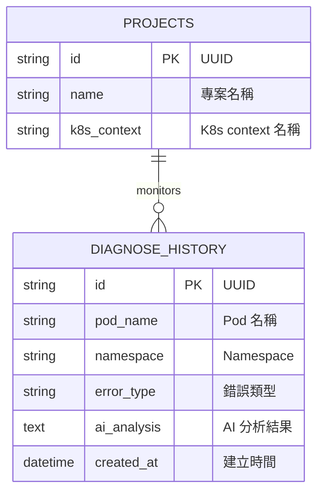
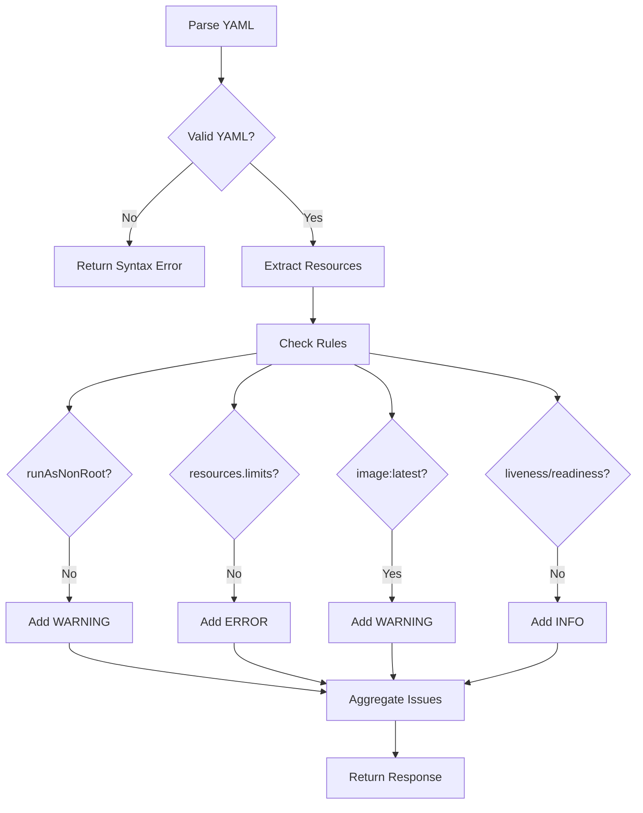

# 🦞 Lobster K8s Copilot - 系統詳細設計文件 (SD)

## 1. 文件資訊
| 項目 | 內容 |
|------|------|
| 文件版本 | 1.0.0 |
| 建立日期 | 2026-03-07 |
| 撰寫者 | System Architect (Lobster Team) |
| 狀態 | Approved |

---

## 2. 資料庫設計 (Database Schema)

### 2.1 ER Diagram



### 2.2 Table Definitions

#### 2.2.1 `projects`
| Column | Type | Constraints | Description |
|--------|------|-------------|-------------|
| `id` | VARCHAR(36) | PK | UUID primary key |
| `name` | VARCHAR(255) | NOT NULL | 專案名稱 |
| `k8s_context` | VARCHAR(255) | NOT NULL | Kubernetes context |

#### 2.2.2 `diagnose_history`
| Column | Type | Constraints | Description |
|--------|------|-------------|-------------|
| `id` | VARCHAR(36) | PK | UUID primary key |
| `pod_name` | VARCHAR(255) | NOT NULL, INDEX | Pod 名稱 |
| `namespace` | VARCHAR(63) | NOT NULL, DEFAULT 'default' | Namespace |
| `error_type` | VARCHAR(100) | NULL | 錯誤類型 (CrashLoopBackOff, OOMKilled, etc.) |
| `ai_analysis` | TEXT | NULL | AI 分析結果 JSON |
| `created_at` | DATETIME | INDEX, DEFAULT NOW() | 建立時間 |

**Indexes:**
- `ix_diagnose_history_pod_namespace (pod_name, namespace)` — 複合索引加速查詢

---

## 3. API 設計 (RESTful API Specification)

### 3.1 Base URL
```
Production: https://lobster.example.com/api/v1
Development: http://localhost:8000/api/v1
```

### 3.2 Endpoints

#### 3.2.1 Cluster APIs

##### GET /cluster/pods
列出叢集中所有 Pod。

**Response 200:**
```json
{
  "pods": [
    {
      "name": "nginx-deployment-abc123",
      "namespace": "default",
      "status": "Running",
      "ip": "10.244.0.5",
      "conditions": [
        {"type": "Ready", "status": "True"}
      ]
    }
  ],
  "total": 1
}
```

##### GET /cluster/status
取得叢集連線狀態。

**Response 200:**
```json
{
  "status": "connected",
  "error": null
}
```

#### 3.2.2 Diagnose APIs

##### POST /diagnose/{pod_name}
對指定 Pod 執行 AI 診斷。

**Path Parameters:**
| Name | Type | Required | Description |
|------|------|----------|-------------|
| `pod_name` | string | Yes | Pod 名稱 |

**Request Body:**
```json
{
  "namespace": "default",
  "force": false
}
```

**Response 200:**
```json
{
  "pod_name": "my-app-abc123",
  "namespace": "default",
  "error_type": "CrashLoopBackOff",
  "root_cause": "應用程式啟動失敗，因為無法連接到資料庫",
  "detailed_analysis": "從日誌分析發現...",
  "remediation": "1. 檢查 DATABASE_URL 環境變數\n2. 確認資料庫服務已啟動",
  "raw_analysis": "...",
  "model_used": "ollama:llama3"
}
```

**Error Responses:**
- `404`: Pod not found
- `422`: Invalid namespace format
- `503`: AI service unavailable

##### GET /diagnose/history
取得診斷歷史記錄。

**Query Parameters:**
| Name | Type | Required | Default | Description |
|------|------|----------|---------|-------------|
| `pod_name` | string | No | - | 過濾特定 Pod |
| `namespace` | string | No | - | 過濾特定 Namespace |
| `limit` | int | No | 50 | 返回筆數 |
| `offset` | int | No | 0 | 分頁偏移 |

**Response 200:**
```json
{
  "records": [
    {
      "id": "550e8400-e29b-41d4-a716-446655440000",
      "pod_name": "my-app-abc123",
      "namespace": "default",
      "error_type": "OOMKilled",
      "ai_analysis": "...",
      "created_at": "2026-03-07T10:30:00Z"
    }
  ],
  "total": 1
}
```

#### 3.2.3 YAML APIs

##### POST /yaml/scan
掃描 YAML 配置檔案。

**Request Body:**
```json
{
  "yaml_content": "apiVersion: v1\nkind: Pod\nmetadata:\n  name: test\nspec:\n  containers:\n  - name: nginx\n    image: nginx:latest",
  "filename": "deployment.yaml"
}
```

**Response 200:**
```json
{
  "filename": "deployment.yaml",
  "issues": [
    {
      "severity": "WARNING",
      "rule": "no-latest-tag",
      "message": "避免使用 :latest 標籤，應指定明確版本",
      "line": 8
    },
    {
      "severity": "ERROR",
      "rule": "missing-resources",
      "message": "未設定 resources.limits，可能導致資源耗盡",
      "line": 6
    }
  ],
  "total_issues": 2,
  "has_errors": true,
  "ai_suggestions": "建議修改如下..."
}
```

##### POST /yaml/diff
比較兩份 YAML 的差異。

**Request Body:**
```json
{
  "yaml_a": "apiVersion: v1\nkind: ConfigMap\ndata:\n  key: value1",
  "yaml_b": "apiVersion: v1\nkind: ConfigMap\ndata:\n  key: value2"
}
```

**Response 200:**
```json
{
  "has_diff": true,
  "changes": [
    {
      "path": "data.key",
      "type": "changed",
      "old_value": "value1",
      "new_value": "value2"
    }
  ]
}
```

---

## 4. Pydantic Schemas

### 4.1 Request Schemas

```python
class DiagnoseRequest(BaseModel):
    namespace: str = "default"
    force: bool = False

class YamlScanRequest(BaseModel):
    yaml_content: str  # max 512KB
    filename: str | None = "manifest.yaml"

class YamlDiffRequest(BaseModel):
    yaml_a: str
    yaml_b: str
```

### 4.2 Response Schemas

```python
class PodInfo(BaseModel):
    name: str
    namespace: str
    status: str | None
    ip: str | None
    conditions: list[dict] = []

class PodListResponse(BaseModel):
    pods: list[PodInfo]
    total: int

class DiagnoseResponse(BaseModel):
    pod_name: str
    namespace: str
    error_type: str | None
    root_cause: str
    detailed_analysis: str | None
    remediation: str
    raw_analysis: str
    model_used: str

class YamlIssue(BaseModel):
    severity: Literal["ERROR", "WARNING", "INFO"]
    rule: str
    message: str
    line: int | None

class YamlScanResponse(BaseModel):
    filename: str
    issues: list[YamlIssue]
    total_issues: int
    has_errors: bool
    ai_suggestions: str | None
```

---

## 5. 核心演算法

### 5.1 YAML 掃描規則



### 5.2 掃描規則清單

| Rule ID | Severity | Description |
|---------|----------|-------------|
| `missing-resources` | ERROR | 未設定 resources.limits |
| `privileged-container` | ERROR | 使用 privileged: true |
| `run-as-root` | WARNING | securityContext.runAsNonRoot 未設定或為 false |
| `no-latest-tag` | WARNING | 使用 :latest 標籤 |
| `missing-probes` | INFO | 缺少 liveness/readiness probe |
| `no-security-context` | INFO | 未設定 securityContext |

### 5.3 AI Prompt Template

```
你是一位資深 Kubernetes 故障診斷專家。以下是 Pod 的錯誤資訊：

【Pod 基本資訊】
- 名稱: {pod_name}
- Namespace: {namespace}
- 狀態: {status}

【錯誤日誌】
{logs}

【Pod Events】
{events}

請分析此 Pod 的故障原因並提供修復建議。請依以下格式回答：

## 錯誤類型
{error_type}

## 根因分析
{root_cause}

## 修復建議
{remediation}
```

---

## 6. 前端組件設計

### 6.1 組件樹狀圖

```
App
├── Header
│   └── Logo + Nav
├── Sidebar
│   └── Menu Items
└── Main Content
    ├── Dashboard (/)
    │   ├── ClusterStatus
    │   ├── PodList
    │   │   └── PodRow (map)
    │   └── DiagnosePanel
    │       ├── DiagnoseForm
    │       └── DiagnoseResult
    └── YAMLEditor (/yaml)
        ├── MonacoEditor
        ├── IssueList
        └── AIFixSuggestion
```

### 6.2 State Management

使用 React Context + useReducer 管理全域狀態：

```typescript
interface AppState {
  pods: PodInfo[];
  selectedPod: string | null;
  diagnoseResult: DiagnoseResponse | null;
  isLoading: boolean;
  error: string | null;
}

type Action =
  | { type: 'SET_PODS'; payload: PodInfo[] }
  | { type: 'SELECT_POD'; payload: string }
  | { type: 'SET_DIAGNOSE_RESULT'; payload: DiagnoseResponse }
  | { type: 'SET_LOADING'; payload: boolean }
  | { type: 'SET_ERROR'; payload: string };
```

---

## 7. 錯誤處理

### 7.1 HTTP 錯誤碼

| Code | Scenario | Response Body |
|------|----------|---------------|
| 400 | Invalid request body | `{"detail": "Validation error message"}` |
| 401 | Invalid API key | `{"detail": "Invalid or missing API key"}` |
| 404 | Resource not found | `{"detail": "Pod not found"}` |
| 422 | Validation error | `{"detail": [{"loc": [...], "msg": "..."}]}` |
| 429 | Rate limit exceeded | `{"detail": "Rate limit exceeded"}` |
| 500 | Internal server error | `{"detail": "Internal server error"}` |
| 503 | AI service unavailable | `{"detail": "AI service unavailable"}` |

### 7.2 錯誤日誌格式

```json
{
  "timestamp": "2026-03-07T10:30:00Z",
  "level": "ERROR",
  "message": "AI diagnosis failed",
  "error": "Connection timeout",
  "pod_name": "my-app",
  "namespace": "default",
  "trace_id": "abc123"
}
```

---

## 8. 環境變數

| Variable | Required | Default | Description |
|----------|----------|---------|-------------|
| `DATABASE_URL` | No | `sqlite:///./lobster.db` | 資料庫連線字串 |
| `OPENAI_API_KEY` | No | - | OpenAI API Key |
| `GEMINI_API_KEY` | No | - | Gemini API Key |
| `OLLAMA_BASE_URL` | No | `http://localhost:11434` | Ollama 端點 |
| `OLLAMA_MODEL` | No | `llama3` | Ollama 模型名稱 |
| `LOBSTER_API_KEY` | No | - | 啟用 API Key 認證 |
| `ALLOWED_ORIGINS` | No | - | CORS 白名單（逗號分隔） |
| `LOG_LEVEL` | No | `INFO` | 日誌等級 |

---

## 9. 測試策略

### 9.1 測試金字塔

```
        /\
       /  \  E2E Tests (5%)
      /----\  Integration Tests (25%)
     /------\  Unit Tests (70%)
    /________\
```

### 9.2 測試檔案結構

```
tests/
├── conftest.py          # Pytest fixtures
├── test_endpoints.py    # API integration tests
├── test_diagnoser.py    # AI engine unit tests
├── test_yaml_service.py # YAML scanner unit tests
└── test_utils.py        # Utility function tests
```

### 9.3 關鍵測試案例

| Test Suite | Test Case | Description |
|------------|-----------|-------------|
| `test_endpoints` | `test_root_endpoint` | 驗證 API 健康檢查 |
| `test_endpoints` | `test_get_pods_success` | 驗證 Pod 列表 API |
| `test_yaml_service` | `test_scan_missing_resources` | 驗證 resources 檢查 |
| `test_yaml_service` | `test_scan_privileged_container` | 驗證 privileged 檢查 |
| `test_diagnoser` | `test_ollama_fallback` | 驗證多模型路由 |
| `test_utils` | `test_mask_sensitive_data` | 驗證資料脫敏 |

---

*文件結束*
