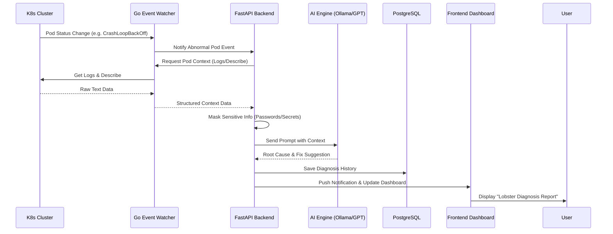

# 🦞 Lobster K8s Copilot - 系統流程設計 (System Flow)

## 1. 核心業務流程 (Core Business Flow)

### 1.1 故障診斷自動化流程 (Auto-Diagnosis Flow)
本流程描述當 Pod 發生故障時，系統如何從偵測到產出 AI 建議。

### 1.2 YAML 預檢與安全掃描流程 (YAML Pre-flight Flow)
本流程描述用戶在部署前，系統如何攔截並優化 YAML。

1.  **提交 (Submit)**：用戶在 Web 編輯器輸入或上傳 YAML。
2.  **靜態分析 (Linter)**：Go 模組執行 `kube-linter` 掃描安全性（如 `runAsNonRoot`）。
3.  **動態預檢 (Dry-run)**：Go 模組調用 K8s API 執行 `server-side dry-run`。
4.  **AI 優化建議**：FastAPI 將 Linter 錯誤發送給 AI，轉換為易懂的「為什麼錯」以及「如何改」。
5.  **結果返回**：前端標註錯誤行號與修復按鈕。

## 2. 關鍵組件交互邏輯 (Key Component Interaction)

### 2.1 資料脫敏機制 (Data Masking)
為了確保資安，所有傳送到 AI Engine 的數據必須經過 `MaskingService`：
- **Regex 過濾**：去除環境變數中的 `AUTH`, `PASS`, `TOKEN`, `KEY` 等欄位。
- **Secret 攔截**：禁止抓取 `Kind: Secret` 的內容。

### 2.2 多模型調度策略 (AI Routing)
- **Local First**：若配置了 Ollama，優先進行本地診斷（快且私密）。
- **Cloud Fallback**：若本地模型信心值過低，且用戶授權，則調用 GPT-4o 進行深度分析。

---
*文件建立日期：2026-03-06*
*撰寫者：Senior Architect (Lobster Team)*
